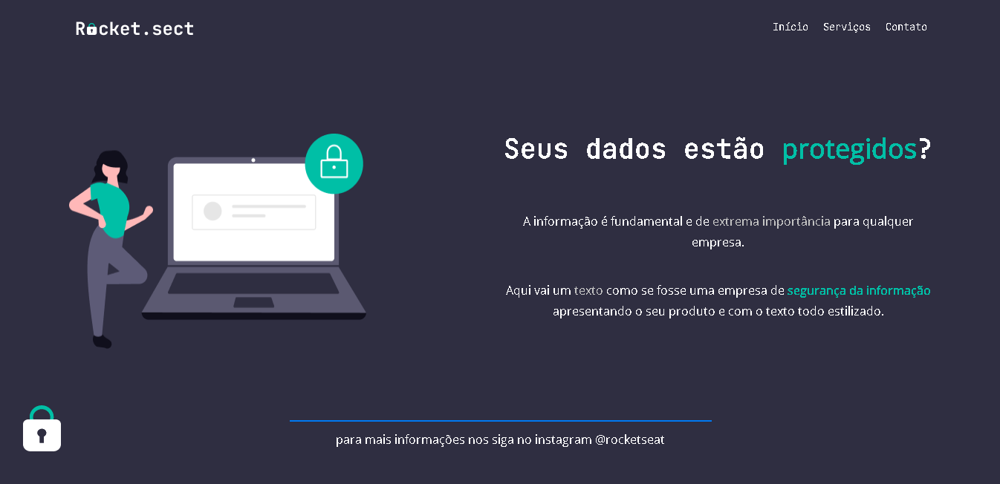

  <a href="#-Tecnologias">Tecnologias</a>&nbsp;&nbsp;&nbsp;|&nbsp;&nbsp;&nbsp;
  <a href="#-Projeto">Projeto</a>&nbsp;&nbsp;&nbsp;|&nbsp;&nbsp;&nbsp;
  <a href="#-Layout">Layout</a>&nbsp;&nbsp;&nbsp;|&nbsp;&nbsp;&nbsp;
  <a href="#memo-licença">Licença</a>

  

 

 
 

## 🚀Tecnologias

Esse projeto foi desenvolvido com as seguintes tecnologias:

- HTML
- CSS

Bibliotecas

- [Google Fonts](https://fonts.google.com/)
- font-family: 'Mulish', sans-serif;
- font-family: 'Open Sans', sans-serif;
 

## 💻 Projeto
 

Móveis customizados é uma página institucional no formato One Page, com a finalidade do desafio Explorer administrado pela Rocketseat.
Contém as seguintes seções em HTML : nav, main, ul, li, footer, div, id, h1, p, span, strong e br.
  

Contém as seguintes seções em CSS : flex-box/ display:flex; justify-content; align-items; margin; padding; width; heigth; list-style;
 
 gap; text-decoration; opacity; hover; line-height; font-weight; color;
  

## 🔖 Layout
 

Você pode visualizar o layout do projeto através [desse link](https://www.figma.com/file/4du0a8cK76lMRFofOoZlUI/Explorer-(Copy)?node-id=0%3A1). É necessário ter conta no [Figma](https://figma.com) para acessá-lo.
  

## 📝 Licença
 

Feito com ♥ by Rocketseat :wave: [Participe da nossa comunidade!](https://discordapp.com/invite/gCRAFhc).